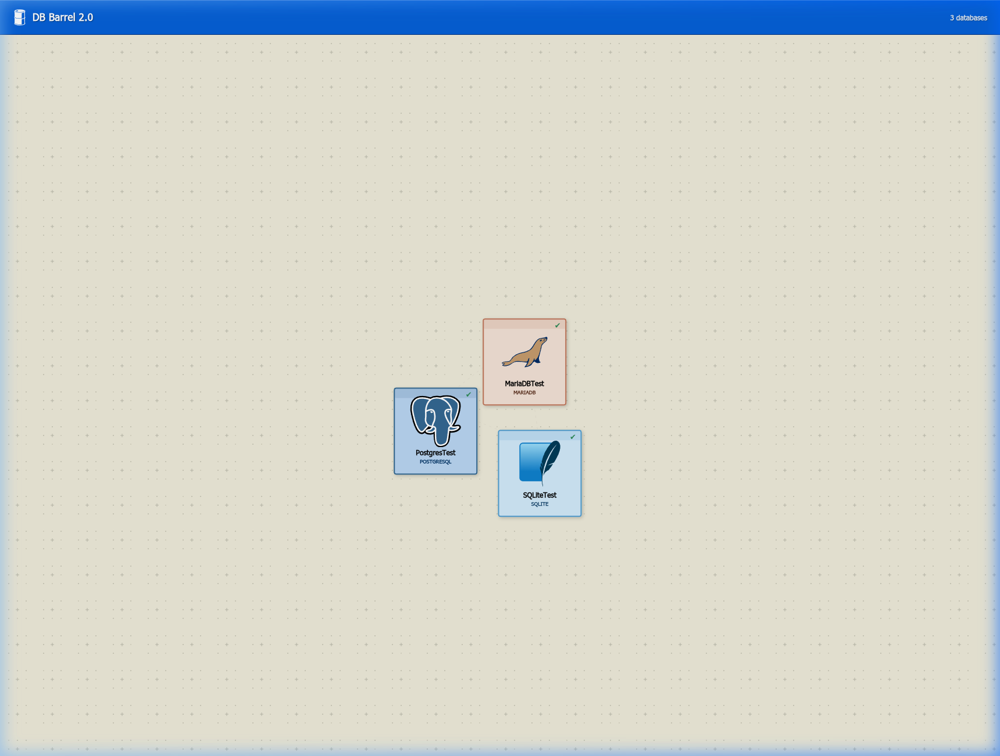
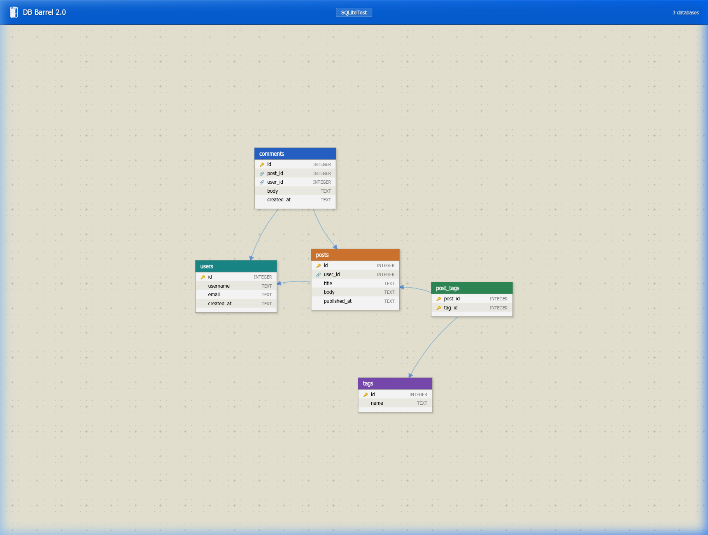
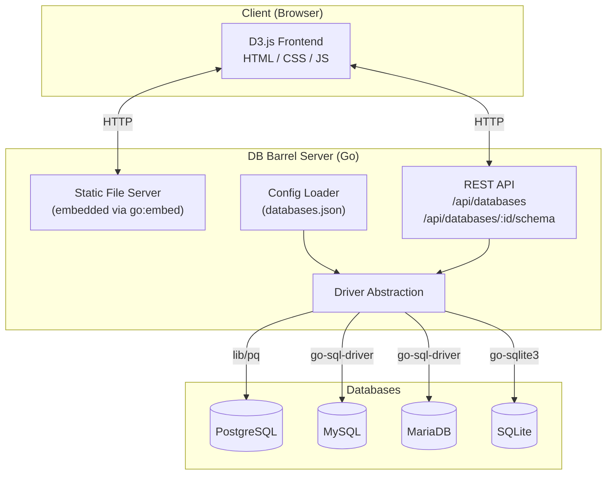
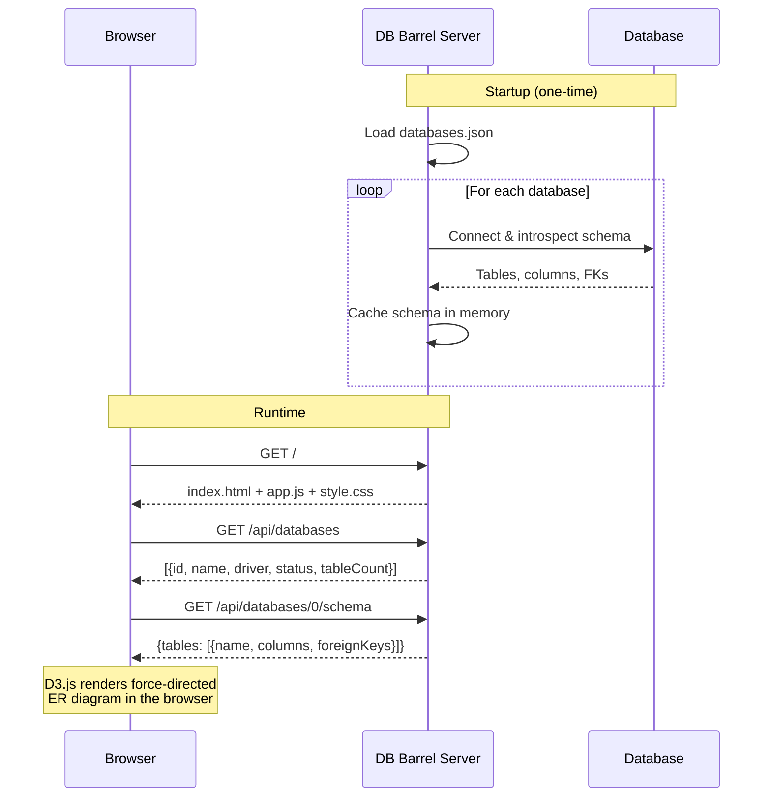
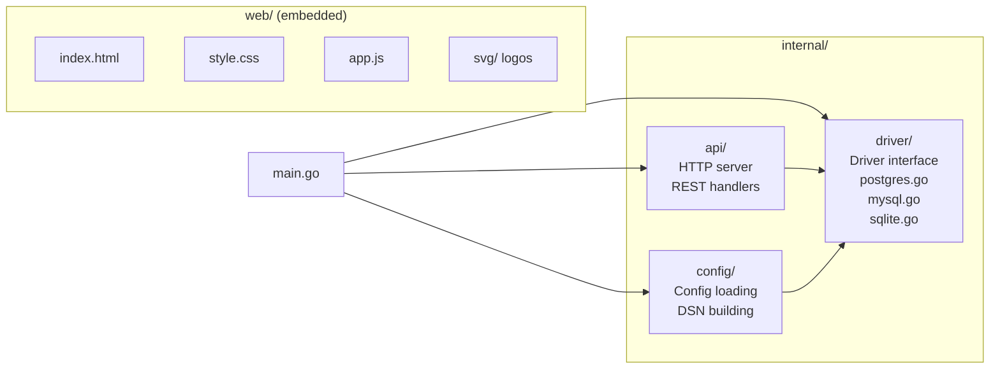

# 🛢 DB Barrel 2.0

**A visual database schema introspection tool.**

DB Barrel connects to your PostgreSQL, MySQL, MariaDB, and SQLite databases and renders interactive, force-directed ER diagrams in the browser. Configure all your databases in a single JSON file, start the server, and explore your schemas visually.

---

## Features

- **Multi-database support** — PostgreSQL, MySQL, MariaDB, SQLite
- **Batch introspection** — register multiple databases in one JSON config; all are introspected at startup
- **Interactive ER diagrams** — force-directed table layouts with drag, zoom, and pan
- **Visual FK relationships** — curved arrows connecting tables along foreign key paths
- **Table detail overlay** — click any table to see columns, types, nullability, primary keys, and foreign keys
- **Database gallery** — landing page shows all registered databases as draggable cards with official logos
- **Zero client-side dependencies** — single Go binary with all assets embedded (HTML, CSS, JS, SVGs)
- **Debian packaging** — ships as a `.deb` with systemd service integration

---

## Screenshots

### Database Gallery
Floating, draggable cards for each registered database with official logos. Click any card to explore its schema.



### Schema View
Interactive ER diagram with color-coded table headers, PK/FK icons, and curved FK relationship arrows. Click any table for a detail overlay.



---

## Architecture

### System Overview



### Request Flow



### Package Layout



---

## Quick Start

### From source

```bash
# Clone
git clone https://github.com/robotelu/db_barrel_2.0.git
cd db_barrel_2.0

# Build (requires Go 1.21+ and CGO for SQLite)
CGO_ENABLED=1 go build -o db_barrel .

# Edit the config with your databases
cp databases.example.json databases.json
nano databases.json

# Run
./db_barrel
# → http://localhost:8080
```

### From `.deb` package

```bash
# Build the .deb
./build-deb.sh

# Install
sudo dpkg -i db-barrel_2.0.0_amd64.deb

# Configure your databases
sudo nano /etc/db-barrel/databases.json

# Start the service
sudo systemctl start db-barrel

# → http://localhost:8080
```

---

## Configuration

All database connections are defined in a single JSON file. Each entry specifies the connection parameters individually (no raw DSN strings).

### Config file location

| Method | Path |
|--------|------|
| From source | `./databases.json` (or `-config path/to/file.json`) |
| `.deb` package | `/etc/db-barrel/databases.json` |

### Example configuration

```json
{
    "databases": [
        {
            "name": "Production API",
            "driver": "postgresql",
            "host": "localhost",
            "port": 5432,
            "user": "admin",
            "password": "secret",
            "database": "api_db",
            "sslMode": "disable"
        },
        {
            "name": "Analytics",
            "driver": "mysql",
            "host": "localhost",
            "port": 3306,
            "user": "root",
            "password": "secret",
            "database": "analytics"
        },
        {
            "name": "User Sessions",
            "driver": "mariadb",
            "host": "db.internal",
            "port": 3307,
            "user": "app",
            "password": "secret",
            "database": "sessions"
        },
        {
            "name": "Local Cache",
            "driver": "sqlite",
            "path": "./cache.db"
        }
    ]
}
```

### Config fields

| Field | Type | Required | Description |
|-------|------|----------|-------------|
| `name` | string | ✅ | Display name shown in the UI |
| `driver` | string | ✅ | One of: `postgresql`, `mysql`, `mariadb`, `sqlite` |
| `host` | string | ✅* | Database server hostname (* not needed for SQLite) |
| `port` | int | — | Server port (defaults: PostgreSQL 5432, MySQL/MariaDB 3306) |
| `user` | string | — | Database username |
| `password` | string | — | Database password |
| `database` | string | ✅* | Database/schema name (* not needed for SQLite) |
| `path` | string | ✅† | SQLite file path (†only for SQLite) |
| `sslMode` | string | — | PostgreSQL SSL mode (`disable`, `require`, `verify-full`, etc.) |
| `params` | string | — | Extra connection parameters appended to the DSN |

---

## Command-Line Options

```
Usage: db_barrel [options]

Options:
  -port int      HTTP server port (default 8080)
  -config string Path to database config JSON file (default "databases.json")
```

**Examples:**
```bash
# Custom port
./db_barrel -port 3000

# Custom config location
./db_barrel -config /path/to/my-databases.json

# Both
./db_barrel -port 9090 -config /opt/configs/databases.json
```

---

## API

DB Barrel exposes a simple REST API used by the frontend. DSNs and credentials are **never** exposed through the API.

| Endpoint | Method | Description |
|----------|--------|-------------|
| `/api/databases` | GET | List all registered databases (id, name, driver, status, tableCount) |
| `/api/databases/{id}/schema` | GET | Get the introspected schema for a specific database |

### Response: `GET /api/databases`

```json
[
    {
        "id": 0,
        "name": "Production API",
        "driver": "postgresql",
        "status": "ok",
        "tableCount": 12
    },
    {
        "id": 1,
        "name": "Legacy DB",
        "driver": "mysql",
        "status": "error",
        "error": "connection refused",
        "tableCount": 0
    }
]
```

### Response: `GET /api/databases/0/schema`

```json
{
    "tables": [
        {
            "name": "users",
            "columns": [
                {
                    "name": "id",
                    "dataType": "integer",
                    "isNullable": false,
                    "isPrimaryKey": true
                },
                {
                    "name": "email",
                    "dataType": "varchar(255)",
                    "isNullable": false,
                    "isPrimaryKey": false
                }
            ],
            "foreignKeys": []
        },
        {
            "name": "posts",
            "columns": [ ... ],
            "foreignKeys": [
                {
                    "constraintName": "fk_posts_user_id",
                    "columnName": "user_id",
                    "referencedTable": "users",
                    "referencedColumn": "id"
                }
            ]
        }
    ]
}
```

---

## Project Structure

```
db_barrel_2.0/
├── main.go                      # Entry point: config loading, introspection, server startup
├── go.mod / go.sum              # Go module definition
│
├── internal/
│   ├── api/                     # HTTP server and API handlers
│   │   ├── server.go            # Routes, handlers, JSON responses
│   │   └── server_test.go       # API tests
│   ├── config/                  # JSON config loading and DSN building
│   │   └── config.go            # Config structs, Load(), BuildDSN()
│   └── driver/                  # Database driver abstraction
│       ├── driver.go            # Driver interface, Schema/Table/Column types
│       ├── driver_test.go       # Driver tests
│       ├── postgres.go          # PostgreSQL introspection via information_schema
│       ├── mysql.go             # MySQL/MariaDB introspection via information_schema
│       └── sqlite.go            # SQLite introspection via PRAGMA
│
├── web/                         # Frontend (embedded in binary via go:embed)
│   ├── index.html               # Single-page HTML shell
│   ├── style.css                # Windows XP-inspired light mode styles
│   ├── app.js                   # D3.js force-directed diagrams and UI logic
│   └── svg/                     # Database logos (PostgreSQL, MySQL, MariaDB, SQLite, barrel)
│
├── svg/                         # Source SVG logos
├── databases.example.json       # Example configuration file
├── databases.json               # Your active configuration (not committed)
│
├── packaging/                   # Debian package files
│   ├── db-barrel.service        # systemd unit file
│   ├── databases.json           # Default config shipped with .deb
│   └── DEBIAN/
│       ├── control              # Package metadata
│       ├── conffiles            # Marks config as user-editable
│       ├── postinst             # Creates system user, enables service
│       ├── prerm                # Stops service before removal
│       └── postrm               # Cleans up on purge
│
├── build-deb.sh                 # Builds the .deb package
└── testdata/                    # Test SQL schemas
    └── schema.sql
```

---

## Debian Package

### Building

```bash
./build-deb.sh
```

This compiles the Go binary, assembles the package tree, and produces `db-barrel_2.0.0_amd64.deb`.

### What gets installed

| Path | Purpose |
|------|---------|
| `/usr/bin/db-barrel` | Application binary |
| `/etc/db-barrel/databases.json` | Configuration file (user-editable, preserved on upgrade) |
| `/lib/systemd/system/db-barrel.service` | systemd service unit |
| `/var/lib/db-barrel/` | Data directory |

### Service management

```bash
sudo systemctl start db-barrel      # Start
sudo systemctl stop db-barrel       # Stop
sudo systemctl restart db-barrel    # Restart (after config changes)
sudo systemctl status db-barrel     # Check status
journalctl -u db-barrel -f          # Follow logs
```

### Uninstallation

```bash
sudo apt remove db-barrel           # Remove (keeps config)
sudo apt purge db-barrel            # Remove everything including config
```

---

## Supported Databases

| Database | Driver | Introspection Method |
|----------|--------|---------------------|
| PostgreSQL | `github.com/lib/pq` | `information_schema` |
| MySQL | `github.com/go-sql-driver/mysql` | `information_schema` |
| MariaDB | `github.com/go-sql-driver/mysql` | `information_schema` |
| SQLite | `github.com/mattn/go-sqlite3` | `PRAGMA table_info`, `PRAGMA foreign_key_list` |

All drivers introspect: tables, columns (name, type, nullability, primary key), and foreign key relationships.

---

## Development

### Prerequisites

- Go 1.21 or later
- GCC (for CGO / SQLite driver)
- `dpkg-deb` (for building `.deb` packages)

### Building

```bash
CGO_ENABLED=1 go build -o db_barrel .
```

### Running tests

```bash
CGO_ENABLED=1 go test ./internal/... -v
```

### Hot reload during development

```bash
# Terminal 1: Run the server
./db_barrel -config databases.json

# Terminal 2: Edit web/ files, then rebuild and restart
CGO_ENABLED=1 go build -o db_barrel . && kill $(pgrep db_barrel) && ./db_barrel &
```

Note: Since frontend assets are embedded with `go:embed`, you must rebuild the binary after editing HTML/CSS/JS files.

---

## Security Notes

- **Credentials are never exposed** via the API. The `/api/databases` endpoint only returns database names, drivers, and connection status.
- The systemd service runs under a dedicated `db-barrel` system user with `NoNewPrivileges`, `ProtectSystem=strict`, and `ProtectHome=true`.
- The config file at `/etc/db-barrel/databases.json` is readable only by root by default. Consider restricting access further if storing sensitive passwords.

---

## License

This project is provided as-is. See the repository for license details.